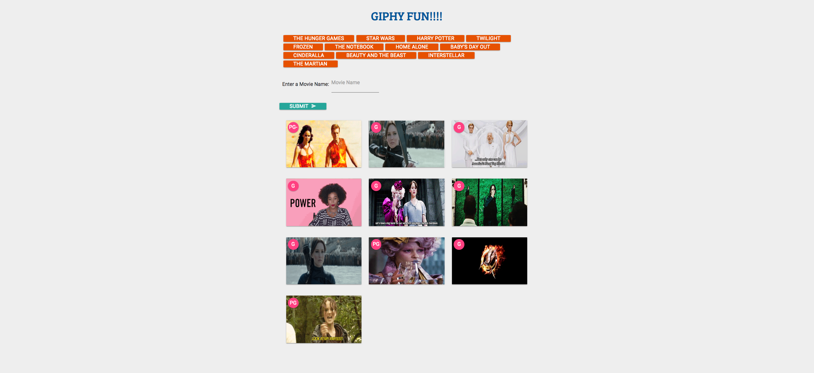

# GiphyAPI

A webpage that displays giphy videos using giphyAPI

## Framework used:
MaterializeCSS : http://materializecss.com/getting-started.html

## API used:
Giphy: https://developers.giphy.com/

## Link to the Deployed webpage:
 https://sahanabalram.github.io/giphyAPI/

 